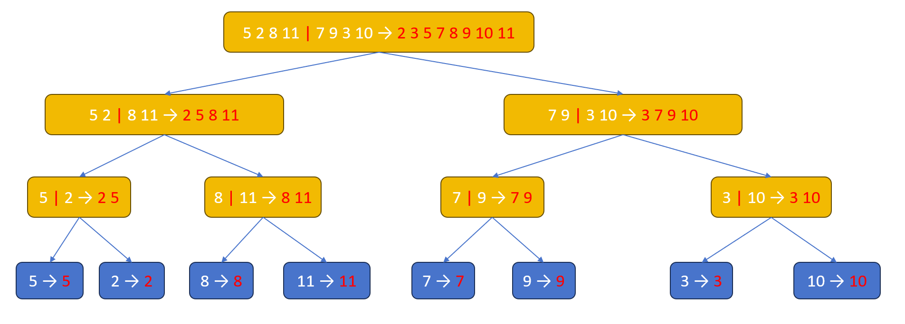
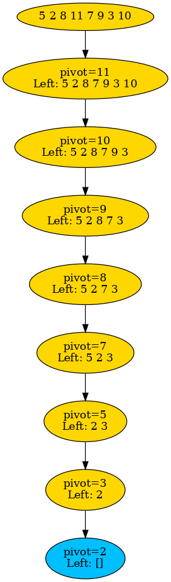
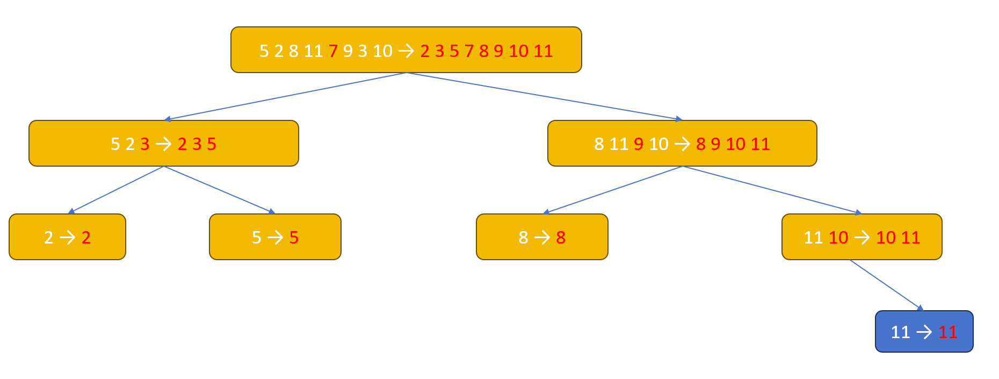

# Exercise on Merge Sort And Quick Sort

# 44251017 HUANG,Jiahui

#### (1) Demonstrate merge sort on sequence S=[5, 2, 8, 11, 7, 9, 3, 10].

```java
Original:         [5, 2, 8, 11, 7, 9, 3, 10]
Divide:           [5, 2, 8, 11]     [7, 9, 3, 10]

Divide again:     [5, 2]  [8, 11]   [7, 9]  [3, 10]
Divide again:     [5] [2] [8] [11]  [7] [9] [3] [10]

Merge:            [2, 5] [8, 11]    [7, 9] [3, 10]
Merge:            [2, 5, 8, 11]     [3, 7, 9, 10]
Final merge:      [2, 3, 5, 7, 8, 9, 10, 11]
```

> 

#### (2) Demonstrate quick sort on sequence S, where you need to show a case such that the random pivot selection selects only bad pivots and taking maximum number of comparisons.

> 

```java
Pivot = 11 → Left: [5, 2, 8, 7, 9, 3, 10]
Pivot = 10 → Left: [5, 2, 8, 7, 9, 3]
Pivot = 9  → Left: [5, 2, 8, 7, 3]
Pivot = 8  → Left: [5, 2, 7, 3]
Pivot = 7  → Left: [5, 2, 3]
Pivot = 5  → Left: [2, 3]
Pivot = 3  → Left: [2]

// Final sorted result:
[2, 3, 5, 7, 8, 9, 10, 11]
// Each step removes only one element (the pivot itself), requiring the maximum number of comparisons.
// O(n²) time complexity in the worst case
```


#### (3) Demonstrate quick sort on sequence S again, where the pivot selection selects only good pivots and taking minimum number of comparisons.

> 
>
> Time Complexity ： O(n log n) 
