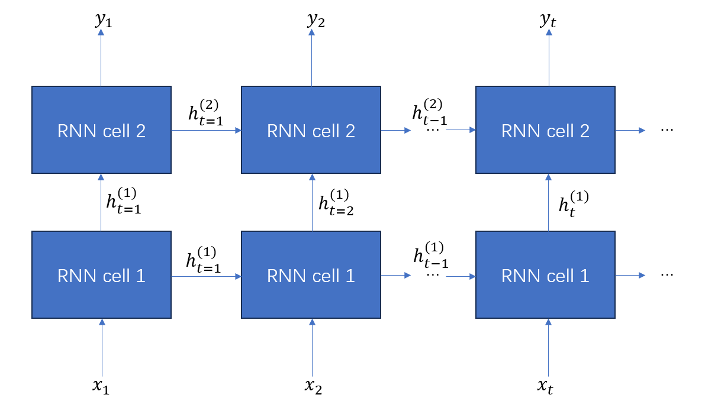
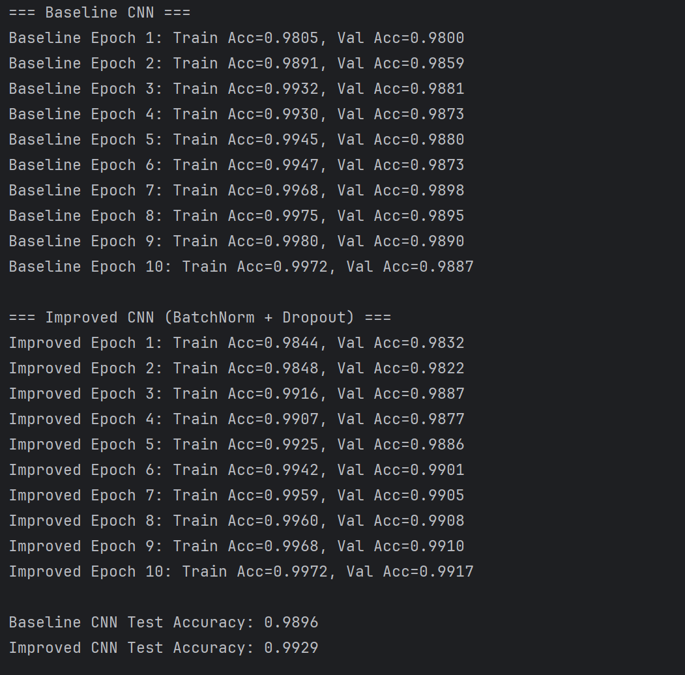

### Assignment5 44251017 Huang Jiahui

#### Q1 Convolutional Neural Network Problem

##### (a)

- **Conv Layer 1** (Kernel 4x4, 8 filters):
  - The input has 3 channels.
  - **Weights**:  (4 × 4 × 3) × 8 = 384
  - **Biases**: 1 per filter = 8
- **Conv Layer 2** (Kernel 8x8, 16 filters):
  - The input has 8 channels from the previous layer.
  - **Weights**: (8 × 8 × 8) × 16 = 8192
  - **Biases**: 1 per filter = 16
- **Max Pooling Layer**: This layer has no trainable weights or biases.
- **Fully Connected Layer 1** (64 neurons):
  - **Weights**: input size × number of neurons = 1,024 × 64 = 65536
  - **Biases**: 1 per neuron = 64
- **Fully Connected Layer 2** (8 neurons):
  - The input size is 64 from the previous layer.
  - **Weights**: 64 × 8 = 512
  - **Biases**: 1 per neuron = 8
- **Softmax Layer**: This layer has no trainable weights or biases.

**Total Parameters**:

- **Total Weights**: 384 + 8,192 + 65,536 + 512 = 74624
- **Total Biases**: 8 + 16 + 64 + 8 = 96

| Layer       | Weights | Biases |
| ----------- | ------- | ------ |
| Conv 1      | 384     | 8      |
| Conv2       | 8192    | 16     |
| Max Pooling | 0       | 0      |
| FC1         | 65536   | 64     |
| FC2         | 512     | 8      |
| Total       | 74624   | 96     |

##### (b)

| Layer      | Output Shape |
| ---------- | ------------ |
| Input      | 84 × 84 × 3  |
| Conv1      | 84 × 84 × 8  |
| Conv2      | 26 × 26 × 16 |
| MaxPooling | 8 × 8 × 16   |
| FC1        | 64           |
| FC2        | 8            |
| Softmax    | 8            |

##### (c)

To compute the receptive field:

Formula: $RF_{out}$ = $RF_{in}$ + ($Kernel_{size}−1$) × $J_{in}$, where $J $ is the cumulative stride.

1. Conv1: Kernel: 4, stride: 1 

   > RF = 1+(4−1)×1=4
   >
   > Cumulative Stride ($J_{out}$) = 1×1=1

2. Conv2: Kernel: 8, stride: 3

   > RF = 4+(8−1)×1=11
   >
   > Cumulative Stride ($J_{out}$) = 1×3=3

3. MaxPooling: Kernel: 3, stride: 3

   > RF = 11+(3−1)×3=11+6=17

The receptive field size of the neurons after the max pooling layer is 17x17

#### Q2 1-D Convolution Problem

**Input:**[1, 2, 6, 7, 8, 9, 1]

- Kernel size = 3, stride = 1, padding = valid
- Output length = 7 - 3 + 1 = 5

**Layer 1 Output**: The first convolutional layer has 4 filters with weights [0,1,0], [0,0,1], [1,0,0], and [1,0,1]

- **Output of Filter 1 ([0,1,0])**: [2, 6, 7, 8, 9]
- **Output of Filter 2 ([0,0,1])**: [6, 7, 8, 9, 1]
- **Output of Filter 3 ([1,0,0])**: [1, 2, 6, 7, 8]
- **Output of Filter 4 ([1,0,1])**: [7, 9, 14, 16, 9]

Output after Conv1: shape = (5×4) =

$$\begin{bmatrix}2&6&1&7\\
6&7&2&9\\
7&8&6&14\\
8&9&7&16\\
9&1&8&9\\  
\end{bmatrix}$$

**Layer 2 Output**: The second layer has 1 filter with a kernel size of 3 and all weights equal to 1. Its depth is 4 to match the previous layer's output channels. It takes the four feature maps from layer 1 as input.

- Input: 5×4 (5 time steps, 4 channels)
- Kernel size = 3, stride = 1, valid padding
- Filter weights: all 1s → 3×4 = 12 weights

So at each step, take 3 rows of shape (3×4) and flatten → dot with all-ones = sum of all 12 values.

- Step 1: sum of first 3 rows =
   `[2+6+1+7 + 6+7+2+9 + 7+8+6+14] = 75`
- Step 2: sum of rows 2-4 =
   `[6+7+2+9 + 7+8+6+14 + 8+9+7+16] = 99`
- Step 3: sum of rows 3-5 =
   `[7+8+6+14 + 8+9+7+16 + 9+1+8+9] = 102`

- **Output of the filter in Layer 2**: [75, 99, 102]

#### Q3 RNN Problem

Each row represents a different layer of RNN cells. The input at each time step $x_t$ feeds into the first RNN cell of that column. The output of RNN Cell $i$ at time $ t$ becomes the input to RNN Cell $i+1$ at the same time $t$. Crucially, the hidden state $h_i$,$t−1$ from RNN Cell $i$ at time $t−1$ is passed as input to RNN Cell $i$ at time $t$. The final output $y_t$ is typically generated from the last RNN cell at time $t$.

 

#### Programming Part

In this part, I choose CNN to solve the problem.

To improve the performance of my CNN on the MNIST dataset, I tried the following techniques:

1. **Added Dropout layers** to reduce overfitting (e.g., after each fully connected layer, with dropout rate 0.5).
2. **Added Batch Normalization** after each convolutional layer to stabilize and accelerate training.

Baseline CNN vs. Improved CNN 

 

