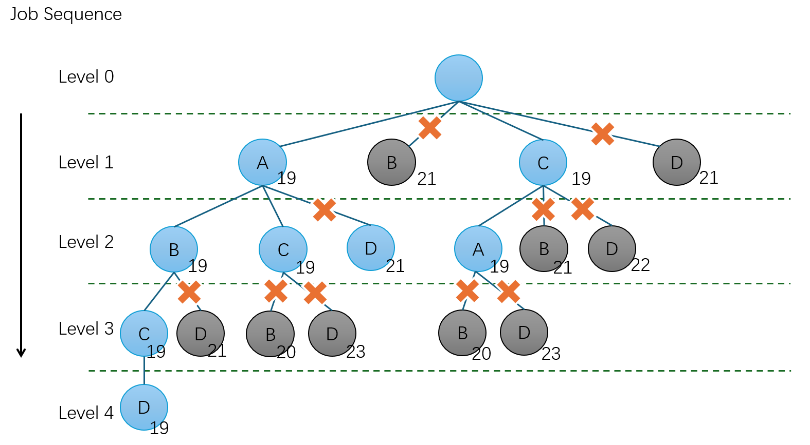

### Assignment5 - 44251017 Huang Jiahui

#### Level1

lower bound of job A in Level 1 =

$max$ {  1st  stage: 3 + (3+4+4) + $min$(8,6,5)    = 19

​	     2nd stage: 5 + (5+2+4) + $min$(3,4,1)    = 17

​	     3rd stage: 10 + (3+4+1) + 0 	          = 18 } = 19

---

lower bound of job B in Level 1 =

$max$ {  1st  stage: 3 + (3+4+4) + $min$(7,6,5)    = 19

​	     2nd stage: 8 + (2+2+4) + $min$(5,4,1)    = 17

​	     3rd stage: 11 + (5+4+1) + 0 	          = 21 } = 21

---

lower bound of job C in Level 1 =

$max$ {  1st  stage: 4 + (3+3+4) + $min$(7,8,5)    = 19

​	     2nd stage: 6 + (2+5+4) + $min$(5,3,1)    = 18

​	     3rd stage: 10 + (5+3+1) + 0 	          = 19 } = 19

---

lower bound of job D in Level 1 =

$max$ {  1st  stage: 4 + (3+3+4) + $min$(7,8,6)    = 20

​	     2nd stage: 8 + (2+5+2) + $min$(5,3,4)    = 20

​	     3rd stage: 9 + (5+3+4) + 0 	             = 21 } = 21

> Thus, it is no need to search node B and node D 

#### Level2

In case of choosing job A, lower bound of job B in Level 2 =

$max$ {  1st  stage: 6 + (4+4) + $min$(6,5)       = 19

​	     2nd stage: 11 + (2+4) + $min$(4,1)    = 18

​	     3rd stage:  14 + (4+1) + 0 	        = 19 } = 19

---

lower bound of job C in Level 2 =

$max$ {  1st  stage: 7 + (3+4) + $min$(8,5)       = 19

​	     2nd stage: 9 + (5+4) + $min$(3,1)       = 19

​	     3rd stage:  14 + (3+1) + 0 	         = 18 } = 19

---

lower bound of job D in Level 2 =

$max$ {  1st  stage: 7 + (3+4) + $min$(8,6)       = 20

​	     2nd stage: 11 + (5+2) + $min$(3,4)    = 21

​	     3rd stage:  12 + (3+4) + 0 	        = 19 } = 21

> Thus, it is no need to search node D 

---

In case of choosing job C, lower bound of job A in Level 2 =

$max$ {  1st  stage: 7 + (3+4) + $min$(8,5)        = 19

​	     2nd stage: 8 + (5+4) + $min$(3,1)       = 18

​	     3rd stage:  15 + (3+1) + 0 	          = 19 } = 19

---

lower bound of job B in Level 2 =

$max$ {  1st  stage: 7 + (3+4) + $min$(7,5)       = 19

​	     2nd stage: 12 + (2+4) + $min$(5,1)     = 19

​	     3rd stage:  15 + (5+1) + 0 	         = 21 } = 21

---

lower bound of job D in Level 2 =

$max$ {  1st  stage: 8 + (3+3) + $min$(7,8)       = 21

​	     2nd stage: 12 + (2+5) + $min$(5,3)    = 22

​	     3rd stage:  13 + (5+3) + 0 	        = 21 } = 22

> Thus, it is no need to search node B and node D 

#### Level3

If we choose the sequence of job AB, lower bound of job C in Level 3 =

$max$ {  1st  stage: 10 + 4 + $min$(5)        = 19

​	     2nd stage: 13 + 4 + $min$(1)        = 18

​	     3rd stage:  18 + 1 + 0 	          = 19 } = 19

lower bound of job D in Level 3 =

$max$ {  1st  stage: 10 + 4 + $min$(6)        = 20

​	     2nd stage: 15 + 2 + $min$(4)        = 21

​	     3rd stage:  16 + 4 + 0 	         = 20 } = 21

> Thus, it is no need to search node D 

---

If we choose the sequence of job AC, lower bound of job B in Level 3 =

$max$ {  1st  stage: 10 + 4 + $min$(5)        = 19

​	     2nd stage: 15 + 4 + $min$(1)        = 20

​	     3rd stage:  18 + 1 + 0 	          = 19 } = 20

lower bound of job D in Level 3 =

$max$ {  1st  stage: 11 + 3 + $min$(8)        = 22

​	     2nd stage: 15 + 5 + $min$(3)        = 23

​	     3rd stage:  16 + 3 + 0 	         = 19 } = 23

> Thus, it is no need to search node D 

---

If we choose the sequence of job CA, lower bound of job B in Level 3 = 

$max$ {  1st  stage: 10 + 4 + $min$(5)        = 19

​	     2nd stage: 15 + 4 + $min$(1)        = 20

​	     3rd stage:  18 + 1 + 0 	          = 19 } = 20

lower bound of job D in Level 3 =

$max$ {  1st  stage: 11 + 3 + $min$(8)        = 22

​	     2nd stage: 15 + 5 + $min$(3)        = 23

​	     3rd stage:  16 + 3 + 0 	         = 19 } = 23

> Thus, it is no need to search node D 

Finally, we choose the sequence A → B → C → D, the process time is 19min

 
